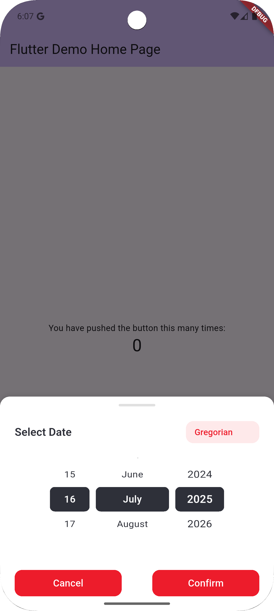
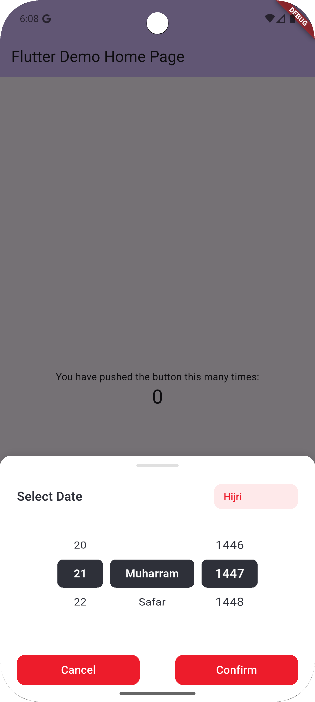
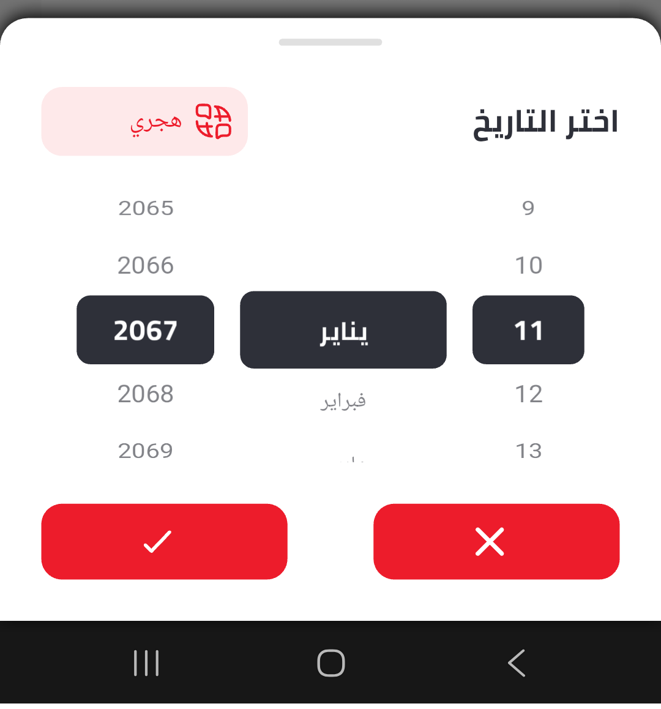

<!--
This README describes the package. If you publish this package to pub.dev,
this README's contents appear on the landing page for your package.

For information about how to write a good package README, see the guide for
[writing package pages](https://dart.dev/tools/pub/writing-package-pages).

For general information about developing packages, see the Dart guide for
[creating packages](https://dart.dev/guides/libraries/create-packages)
and the Flutter guide for
[developing packages and plugins](https://flutter.dev/to/develop-packages).
-->

# Hijri Gregorian Calendar

A comprehensive Flutter package for converting between Hijri (Islamic) and Gregorian calendars with beautiful UI components. **All classes are prefixed with `HijriGreg` to avoid conflicts with other date packages.**

## Features

- ✅ **Two Beautiful UI Designs**: V1 (scroll picker) and V2 (calendar grid + time picker)
- ✅ **High Performance**: Optimized caching system eliminates lag when switching calendars
- ✅ Accurate Hijri-Gregorian date conversion using astronomical calculations
- ✅ Interactive date picker with month navigation
- ✅ **Time Selection**: Predefined time slots in V2 design
- ✅ Switch between Hijri and Gregorian views instantly
- ✅ Proper month names in both English and Arabic
- ✅ Leap year calculations for both calendar systems
- ✅ Today indicator and date selection
- ✅ **90% fewer conversion calls** through smart caching
- ✅ Comprehensive test coverage
- ✅ **Unique class names** to prevent conflicts with other packages

## Installation

Add this to your package's `pubspec.yaml` file:

```yaml
dependencies:
  hijri_gregorian_calendar: ^0.1.1
```

Then run:
```bash
flutter pub get
```

## Usage

### Basic Usage

```dart
import 'package:flutter/material.dart';
import 'package:hijri_gregorian_calendar/hijri_gregorian_calendar.dart';

void main() {
  runHijriGregCalendarApp();
}
```

### Custom Implementation

```dart
import 'package:flutter/material.dart';
import 'package:hijri_gregorian_calendar/hijri_gregorian_calendar.dart';

class MyApp extends StatelessWidget {
  @override
  Widget build(BuildContext context) {
    return MaterialApp(
      title: 'My Calendar App',
      theme: ThemeData(primarySwatch: Colors.blue),
      home: HijriGregCalendarScreen(),
    );
  }
}
```

### Bottom Sheet Widgets

#### HijriGregBottomSheet (V1 Design)
```dart
import 'package:flutter/material.dart';
import 'package:hijri_gregorian_calendar/hijri_gregorian_calendar.dart';

// Show V1 design with scroll picker
showModalBottomSheet(
  context: context,
  builder: (context) => HijriGregBottomSheet(
    initialDate: DateTime.now(),
    initialShowGregorian: true,
    onDateSelected: (DateTime selectedDate) {
      print('Selected: $selectedDate');
      Navigator.pop(context);
    },
    showCalendarToggle: true,
    language: 'en', // or 'ar' for Arabic
    fontFamily: 'Poppins',
  ),
);
```

#### HijriGregBottomSheetV2 (V2 Design)
```dart
import 'package:flutter/material.dart';
import 'package:hijri_gregorian_calendar/hijri_gregorian_calendar.dart';

// Show V2 design with calendar grid and time picker
showModalBottomSheet(
  context: context,
  isScrollControlled: true,
  builder: (context) => HijriGregBottomSheetV2(
    initialDate: DateTime.now(),
    initialTime: TimeOfDay.now(),
    initialShowGregorian: true,
    onDateTimeSelected: (DateTimeResult result) {
      print('Selected Date: ${result.date}');
      print('Selected Time: ${result.time}');
      print('Combined DateTime: ${result.dateTime}');
      Navigator.pop(context);
    },
    showCalendarToggle: true,
    language: 'en', // or 'ar' for Arabic
    fontFamily: 'Poppins',
    height: 800, // Recommended height for V2
  ),
);
```

```dart
import 'package:hijri_gregorian_calendar/hijri_gregorian_calendar.dart';

// Convert Gregorian to Hijri
DateTime gregorianDate = DateTime(2024, 7, 14);
HijriGregDate hijriDate = HijriGregConverter.gregorianToHijri(gregorianDate);
print(hijriDate.format()); // "8 Muharram 1446"

// Convert Hijri to Gregorian
HijriGregDate hijri = HijriGregDate(day: 1, month: 9, year: 1445);
DateTime gregorian = HijriGregConverter.hijriToGregorian(hijri);
print(gregorian); // Corresponding Gregorian date

// Create current Hijri date
HijriGregDate today = HijriGregDate.now();
print(today.format(useArabicNames: true)); // Uses Arabic month names
```

### Working with HijriGregDate

```dart
// Create a Hijri date
HijriGregDate hijriDate = HijriGregDate(day: 15, month: 9, year: 1445);

// Get month names
print(hijriDate.monthNameEnglish); // "Ramadan"
print(hijriDate.monthNameArabic);  // "رمضان"

// Format the date
print(hijriDate.format()); // "15 Ramadan 1445"
print(hijriDate.format(useArabicNames: true)); // "15 رمضان 1445"
print(hijriDate.toString()); // "15/9/1445 H"

// Convert to Gregorian
DateTime gregorian = hijriDate.toGregorian();
```

### Utility Functions

```dart
// Check if a Hijri year is a leap year
bool isLeap = HijriGregConverter.isHijriLeapYear(1445);

// Get the number of days in a Hijri month
int daysInMonth = HijriGregConverter.getHijriMonthLength(1445, 9); // 29 or 30
```

## Components

### HijriGregCalendarScreen
The main calendar interface that displays both Hijri and Gregorian dates with the ability to switch between them.

### HijriGregDatePicker
A custom date picker that works with both calendar systems, allowing users to select dates in either Hijri or Gregorian format.

### HijriGregDate
A model class representing a Hijri date with day, month, and year components.

### HijriGregConverter
A utility class for converting between Hijri and Gregorian dates using proper astronomical calculations.

## Class Names

**All classes are prefixed with `HijriGreg` to avoid naming conflicts with other date packages:**

- `HijriGregDate` - instead of generic `HijriDate`
- `HijriGregConverter` - instead of generic `HijriConverter`
- `HijriGregCalendarScreen` - instead of generic `CalendarScreen`
- `HijriGregDatePicker` - instead of generic `DatePicker`
- `HijriGregCalendarApp` - instead of generic `CalendarApp`

## Calendar Systems

### Hijri Calendar
- Based on lunar months
- 12 months per year
- Months alternate between 29 and 30 days
- Leap years have 30 days in the 12th month instead of 29
- Uses the Umm al-Qura calendar system

### Gregorian Calendar
- Based on solar year
- Standard international calendar
- Proper leap year calculations

## Screenshots








The package provides a clean, Material Design-compliant interface with:
- Date display with primary and secondary calendar views
- Toggle button to switch between calendar systems
- Date picker with month navigation
- Today indicator and date selection
- Responsive design that works on all screen sizes

## API Reference

### HijriGregDate Class

#### Constructors
- `HijriGregDate({required int day, required int month, required int year})`
- `HijriGregDate.now()` - Creates current Hijri date

#### Properties
- `int day` - Day of the month (1-30)
- `int month` - Month of the year (1-12)
- `int year` - Hijri year
- `String monthNameEnglish` - Month name in English
- `String monthNameArabic` - Month name in Arabic

#### Methods
- `DateTime toGregorian()` - Convert to Gregorian date
- `String format({bool useArabicNames = false})` - Format as readable string
- `String toString()` - String representation

### HijriGregConverter Class

#### Static Methods
- `HijriGregDate gregorianToHijri(DateTime gregorianDate)` - Convert Gregorian to Hijri
- `DateTime hijriToGregorian(HijriGregDate hijriDate)` - Convert Hijri to Gregorian
- `bool isHijriLeapYear(int year)` - Check if Hijri year is leap year
- `int getHijriMonthLength(int year, int month)` - Get days in Hijri month

### HijriGregCalendarScreen Class

#### Usage
```dart
HijriGregCalendarScreen() // Main calendar interface
```

### HijriGregDatePicker Class

#### Usage
```dart
HijriGregDatePicker(
  initialDate: DateTime.now(),
  isGregorian: true,
  onDateSelected: (DateTime date) {
    // Handle date selection
  },
)
```

### HijriGregCalendarApp Class
#### Usage
```dart
HijriGregCalendarApp() // Complete app widget
runHijriGregCalendarApp() // Convenience function
```

## Why Unique Class Names?

This package uses the `HijriGreg` prefix for all classes to prevent conflicts with other date packages that might use generic names like `HijriDate`, `DateConverter`, etc. This ensures:

- **No import conflicts** with other packages
- **Clear identification** of this package's components
- **Future-proof** against new packages with similar names
- **Professional package design** following best practices

## Contributing

Contributions are welcome! Please feel free to submit a Pull Request.

## License

This project is licensed under the MIT License - see the LICENSE file for details.

## Author

Aamir Saleem Ahmad - amirsaleemahmad@gmail.com

## Changelog

### 0.0.1

### 0.0.4
- Fixed design updates
- Scrollable actions fixed
- Stability fixes
- Added font style support based on language

### 0.1.0
- added design updates
- Grid Design fixes
- Stability fixes
- Added font style support based on language.
- added Design param DesignType (V1, V2)

### 0.1.1
- added design updates
- Grid Design fixes
- Stability fixes
- Added font style support based on language.
- added time Slots
